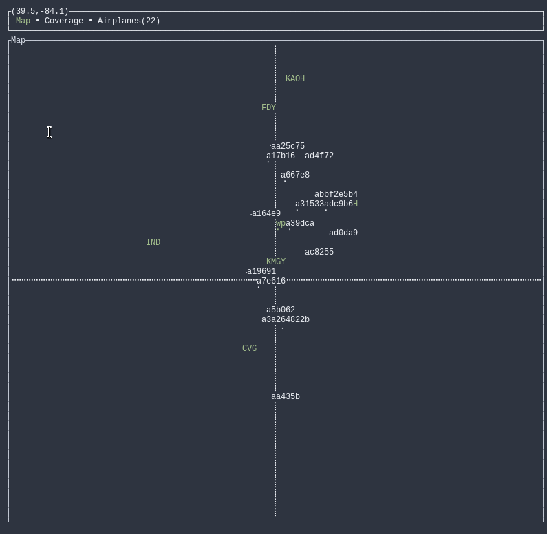

# adsb_deku

[](https://crates.io/crates/adsb_deku)
[](https://docs.rs/adsb_deku)
[](https://github.com/wcampbell0x2a/adsb_deku/actions)
[](https://deps.rs/repo/github/rsadsb/adsb_deku)


Decoder for [ADS-B(Automatic Dependent Surveillance-Broadcast)](https://en.wikipedia.org/wiki/Automatic_Dependent_Surveillance%E2%80%93Broadcast) Downlink Format protocol packets from 1090mhz. See [dump1090_rs](https://github.com/wcampbell0x2a/dump1090_rs.git) for a Rust demodulator. View planes in the sky around you, with only a [rtl-sdr](https://www.rtl-sdr.com/)!

See [rsadsb-blog](https://rsadsb.github.io/) for release details.

This library uses [deku](https://github.com/sharksforarms/deku) for deserialization of protocol.



## Applications
### Client Applications

Client applications use this library to display the data accumulated from an ADS-B demodulation server in various ways.

#### radar tui
An ADS-B client for the terminal written in Rust. Radar connects to an ADS-B demodulation server
and stores this info, allowing an operator to control the display of the data.

- **Map Tab** - Plot currently detected aircraft on lat/long grid. Add known locations with `--locations` option.
- **Coverage Tab** - Plot all detected aircraft lat/long positions since starting radar. Features grayscale heatmap.
- **Aircraft Tab** - Show detailed table of information about currently detected aircraft. Set aircraft position as center lat/long.
- **gpsd** - Derive lat/long from a gpsd instance using `--gpsd` flag.

See [apps/README.md](apps) for map control keybindings.

This application uses [tui-rs](https://github.com/fdehau/tui-rs) for generating the display to terminal.

```text
# Startup "radar" display in tui relative to your antenna position
> cd apps
> cargo r --bin radar --release -- --lat="50.0" --long="50.0" --locations "(name,lat,long)" "(name,lat,long)"
```

#### 1090
Display protocol data structures and currently tracked planes using this library in the same fashion as `dump1090-fa`
to a terminal stdout. Optionally panic on missing implementation or `fmt::Display`, see `> ./1090 -h`.

```text
# Startup 1090 decode chain using this library
> cd apps
> cargo r --bin 1090 --release -- --debug
```


### Server/Demodulation(External) Applications

This library contains logic for decoding a message, you must use a server for demodulating the message
from 1090mhz into bytes usable by this library. These are called `Server` applications.

#### (Rust) [dump1090_rs](https://github.com/wcampbell0x2a/dump1090_rs.git)
Rust translation of the popular C `dump1090` tools, with demodulation and data forwarding functions.
```text
> cargo r --release
```

## Library
See [libadsb_deku](libadsb_deku) for more details.
